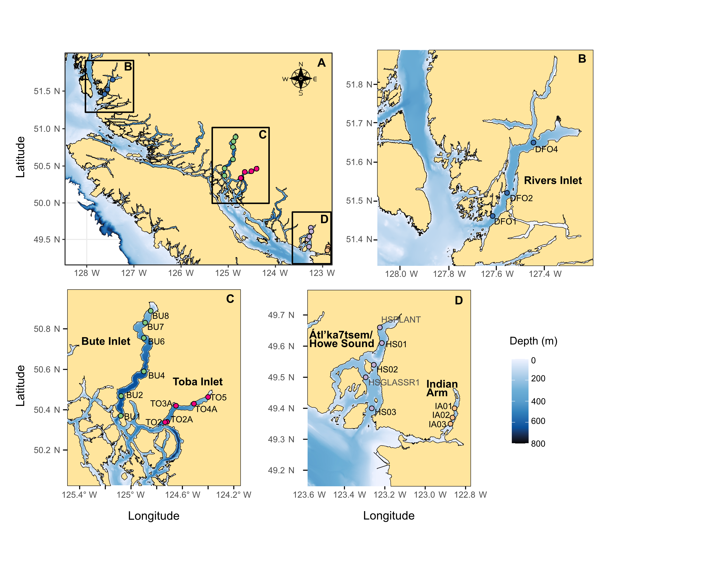

# Fjords_conservation
Processing and analysis of 12S MiFish-U eDNA data for paper on fjord conservation.
To learn more: https://fjedna.shinyapps.io/census-app1/
<picture>
 <source media="(prefers-color-scheme: dark)" srcset="www/Figure1_map.png">
 
</picture>

# Citation
to come

# Folders
00_data: contains raw table file generated from the BARQUE pipeline. Fastq sequences were annotated with MIDORI and a custom database centered on British Columbia species of fish.
01_tables: contains the processed table produced by 01_eDNA_table_manip - BARQUE - 12S.R

# Files
01_Metadata_all.csv: Full metadata
01_Metadata_site.csv: Compiled metadata (no replicates)
01_taxo_all_genus.csv: taxonomy file
01_updated_common_names.csv: list of fish common names

# Scripts
01_eDNA_table_manip - BARQUE - 12S.R: script to process and filter raw table and produce relative abundance and eDNA Index table
02_clustering_stations_fjords_NMDS - Bray - Index.R: Beta-diversity analysis (mostly NMDS)
03_heatmap_CPs.R: Create an average eDNA Index heatmap and Indval analysis per categories for Conservation Priority species (CPS)
04_alpha_breakaway.R: Alpha diversity analysis
05_vertical_maps_loop.R: Map the vertical distribution of eDNA Index in fjords for CPS
